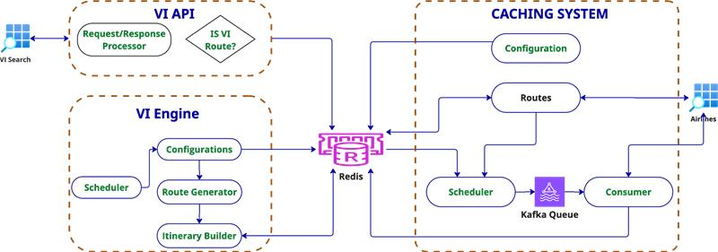

**For Developers (with source code)**
1. Clone the repository.
2. Navigate to the project root directory.
3. Run the following command :
   <pre> mvn clean install  
    docker compose -f docker-compose-dev.yaml up --build</pre>
4. For detached mode :
   <pre> mvn clean install  
    docker compose -f docker-compose-dev.yaml up -d --build</pre>

**For Testing Only (with prebuilt image)**
1. Clone the repository.
2. Navigate to the project root directory.
3. Run the following command :
   <pre> docker compose up --pull always </pre>
4. For detached mode :
   <pre> docker compose up -d --pull always </pre>

**ARCHITECTURE**

## 🧩 System Architecture: VI Flight Itinerary Builder

This architecture describes the flow of flight segment data from ingestion to multi-leg itinerary generation.  
The system is composed of three primary components: **Producer**, **Consumer**, and **VI Logic Implementor**,  
with **Redis** acting as the central cache for segment storage and retrieval.

---

### 🏗️ Frame 1: Producer

**Modules:**
- `ROUTE-SERVICE`: Manages configurations and individual flight route storage.
- `PRODUCER SCHEDULER`: Triggers data fetches based on TTL and route configurations.

**Responsibilities:**
- Reads configurations from cache.
- Creates flight search request for each route based on TTL.
- Creates structured **search requests**.
- Passes these requests to the **Consumer** for processing.

---

### 🛒 Frame 2: Consumer

**Responsibilities:**
- Receives flight requests from the **Producer**.
- Calls external flight APIs using scheduler timings.
- Stores flight data in **Redis** as **segments** per flight.

**Redis Interaction:**
- **Write**: Saves processed segment data into Redis.
- **Read**: Supplies segments to the VI Logic Implementor for itinerary generation.

---

### 🧠 Frame 3: VI Engine

**Responsibilities:**
- Retrieves segment data from Redis.
- Builds graphs of potential connections (legs).
- Identifies valid travel paths (2–3 stop itineraries).
- Applies filters for layovers, airline diversity, and date checks.
- Returns or stores **final valid route combinations**.

---

### 💾 Redis Cache (Central Store)

- Acts as a **shared memory layer** between components.
- Stores flight segments with high-speed access.
- Enables stateless services and decouples data producers from consumers.

---

### 🔁 Flow Summary

Producer reads route configurations and TTL.

Producer fetches flight data and passes it to Consumer.

Consumer calls APIs and stores segments in Redis.

VI Logic Implementor reads segments from Redis.

It builds graphs, finds valid paths, filters, and outputs itineraries.

---

### ✅ Key Advantages

- ⚙️ **Scalable**: Async design allows independent scaling.
- 🧱 **Modular**: Clear separation between route storage, data fetching, and logic.
- ⚡ **Fast**: Uses Redis for ultra-fast read/write access.
- 🔄 **Flexible**: Easily configurable and supports mixed-airline logic.

## 🔧 Features

1. ✈️ Fetches flight **Segment data** by airline and route keys.
2. ✅ Validates **active airlines** from Redis.
3. 🧱 Builds **route graphs** and identifies valid multi-leg paths.
4. 🔀 Generates **2–3 stop itineraries** across multiple airlines.
5. 🔍 Filters results using **layover rules** and **airline diversity**.
6. ⚡ Utilizes **asynchronous execution** for rapid segment fetching.

---

## 🔁 VI Implementation Flow Overview

1. ✅ **Check** if the origin-destination route exists in Redis.
2. 🔑 **Fetch** segment keys based on the selected travel date.
3. 🛫 **Build** route legs and construct the full route graph.
4. 🧭 **Find** valid travel paths from origin to destination.
5. ✈️ **Fetch** corresponding flight segments from Redis.
6. 🧠 **Generate and filter** viable itineraries for the user.

---